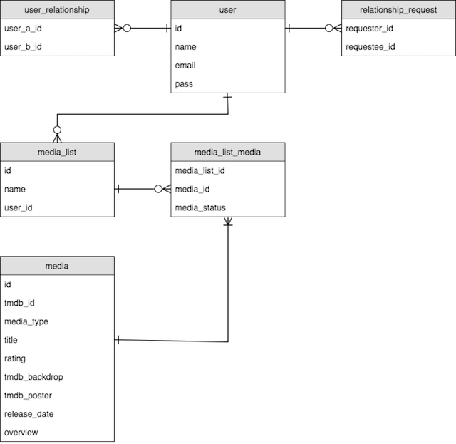
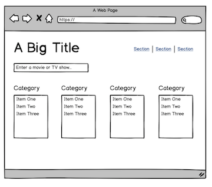
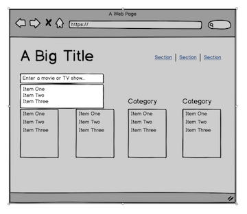
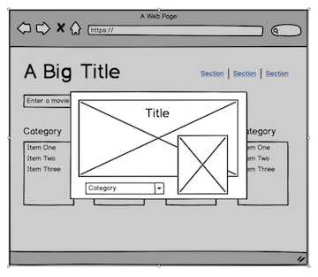
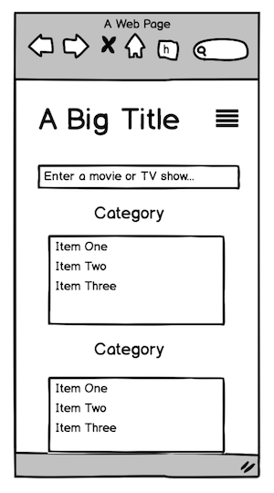

# track-things

### unit-4-project

## requirements

- ~~3 models~~
- ~~React~~
- ~~Node.js, Express, Sequelize, Postgres~~
- ~~complete RESTful routes for one of resources~~
- ~~wireframes~~
- ~~user stories~~
- ~~ERD~~
- ~~clean code~~
- test suite
- sign up, log in, encrypted, authorization flow

## optional goals

- deployed to AWS

## erd

## wireframes

## technologies used

- react
- express
- sequelize
- mocha, chai, supertest
- istanbul

## approach taken

- design ERD and wireframes
- design back-end routes
- launch docker container
- design front-end
- fix back-end bugs
